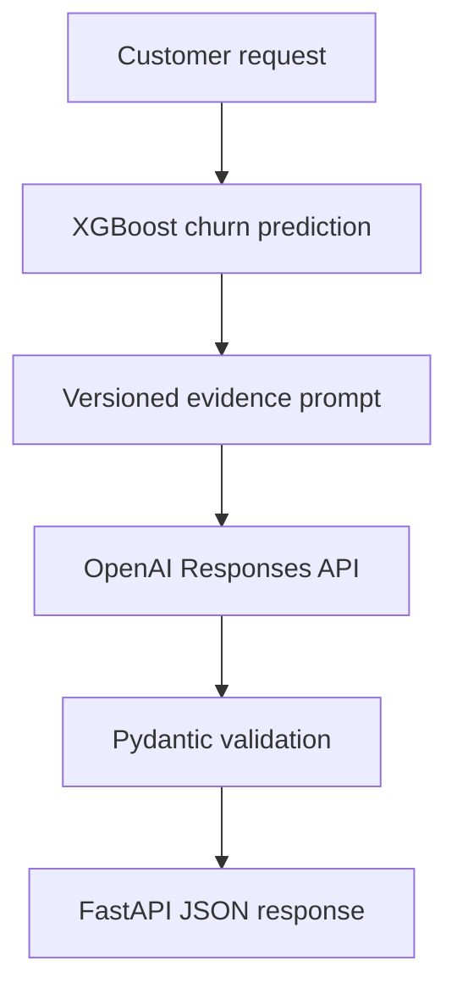

# EnterpriseIQ

EnterpriseIQ is a production-oriented customer intelligence platform that combines
machine learning, structured enterprise data, retrieval-augmented generation, and
agentic AI workflows.

## Planned capabilities

- Predict customer churn with a reproducible ML pipeline
- Explain individual customer risk factors
- Query customer information through controlled read-only tools
- Retrieve retention policies using RAG
- Generate evidence-backed retention recommendations
- Require human approval for sensitive actions
- Track model, retrieval, agent, latency, and cost metrics
- Deploy through Docker, CI/CD, and AWS

## Planned technology stack

- Python
- Pandas and NumPy
- scikit-learn and XGBoost
- MLflow
- FastAPI and Pydantic
- PostgreSQL and pgvector
- LangChain and LangGraph
- RAG evaluation
- LLM observability
- Docker
- GitHub Actions
- AWS

## Current project status

### Completed

- Professional Python package and configuration
- Automated testing, linting, typing, and CI
- Reproducible IBM customer-churn dataset download
- Dataset schema validation
- Exploratory data analysis and visualizations
- Leakage-safe preprocessing pipeline
- Stratified train/test splitting
- Dummy-classifier benchmark
- Logistic Regression baseline
- Automated model metrics and confusion matrices
- Five-fold stratified cross-validation
- Logistic Regression, Decision Tree, Random Forest, and XGBoost comparison
- PR-AUC-based model selection
- Held-out champion-model evaluation
- Automated model-comparison reports
- Hyperparameter tuning for Logistic Regression and XGBoost
- Grid search and reproducible randomized search
- Out-of-fold probability generation
- Business-aware classification-threshold selection
- False-positive and false-negative cost analysis
- Precision-recall and ROC evaluation
- Serialized production ML candidate
- Sigmoid probability calibration
- Brier-score and log-loss evaluation
- Calibrated business-threshold selection
- Permutation feature importance
- MLflow experiment tracking
- Reproducible model metadata
- Production-oriented model card

## Structured Customer Analysis

EnterpriseIQ combines deterministic churn inference with structured LLM
decision support.



The machine-learning model calculates the churn probability. The LLM receives
that fixed prediction along with the supplied customer attributes and support
summary. It does not calculate or modify the prediction.

The generated response includes:

- An executive summary
- Identified risk factors
- Prioritized retention actions
- Human-approval requirements
- A customer-message draft
- Known limitations
- Token usage and latency metadata

### Run a customer analysis

Configure `OPENAI_API_KEY` in the ignored `.env` file and start the API:

```bash
uvicorn enterpriseiq.api.main:app --host 127.0.0.1 --port 8000
```

Send the included example request:

```bash
curl -X POST \
  http://127.0.0.1:8000/api/v1/ai/customer-analysis \
  -H "Content-Type: application/json" \
  --data @examples/customer_analysis_request.json
```

### Failure behavior

When an LLM provider is not configured or temporarily unavailable, the
customer-analysis endpoint returns HTTP 503. The deterministic churn-prediction
endpoint remains available.

### Current limitations

- Generated recommendations are decision support and require human review.
- The LLM is grounded only in evidence supplied with the request.
- Enterprise document retrieval and policy citations will be added through RAG.
- Production authentication, rate limiting and distributed tracing are not yet
  implemented.
- The current calibration experiment did not improve Brier score or log loss;
  the model card records this result transparently.

### Current model workflow

Run baseline training with:

```bash
python -m enterpriseiq.ml.train_baseline
```
## Local setup

Create the virtual environment:

```bash
python3.11 -m venv .venv
source .venv/bin/activate
```

Install the project:

```bash
python -m pip install --upgrade pip
python -m pip install -e ".[dev]"
```

Create local configuration:

```bash
cp .env.example .env
```

Run the application:

```bash
python -m enterpriseiq.main
```

Run the quality checks:

```bash
ruff check .
ruff format --check .
mypy src tests
python -m pytest
```

Run cross-validated model comparison with:

```bash
python -m enterpriseiq.ml.compare_models
```

Run production-candidate optimization with:

```bash
python -m enterpriseiq.ml.optimize_model
```

Run model finalization and MLflow tracking with:

```bash
python -m enterpriseiq.ml.finalize_model
```

View experiments locally with:

```bash
mlflow ui \
  --backend-store-uri sqlite:///mlruns/mlflow.db \
  --port 5000 \
  --workers 1
```

Then open:

```bash
http://127.0.0.1:5000
```

## Project status

This project is under active development as part of an implementation-focused
AI/ML engineering program.