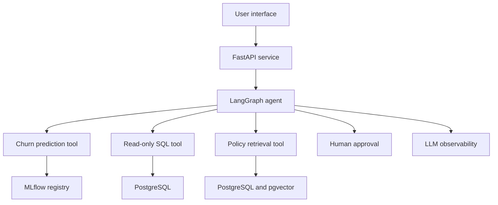

# EnterpriseIQ Architecture

## Business objective

EnterpriseIQ helps customer-retention teams identify customers who may churn,
understand the contributing factors, retrieve applicable company policies, and
produce evidence-backed retention recommendations.

## Planned system

## Major capabilities

1. Customer churn prediction
2. Model explanation
3. Natural-language customer analysis
4. Document retrieval with citations
5. Controlled SQL queries
6. Agent tool orchestration
7. Human approval for sensitive actions
8. ML and RAG evaluation
9. Monitoring and audit logging

## Architectural principles

- Reproducible data and ML pipelines
- Separation between training and inference
- Read-only access for AI-generated SQL
- No secrets committed to Git
- Structured and validated model output
- Citations for document-grounded answers
- Human approval before sensitive actions
- Automated testing before deployment